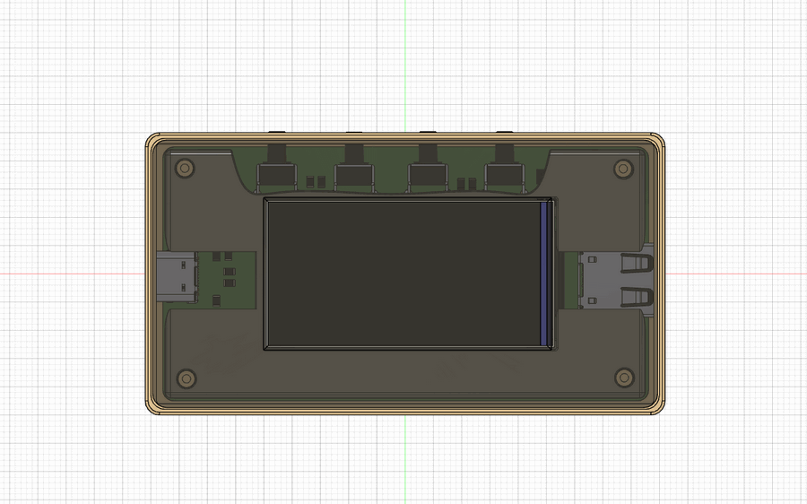
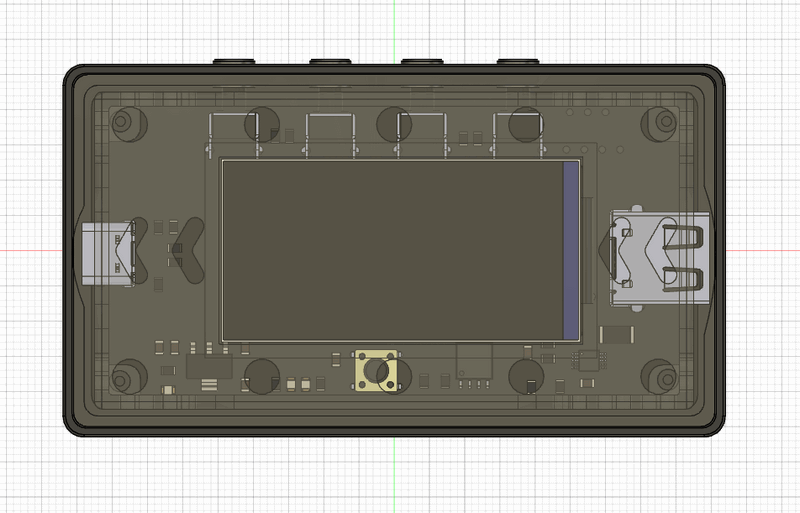
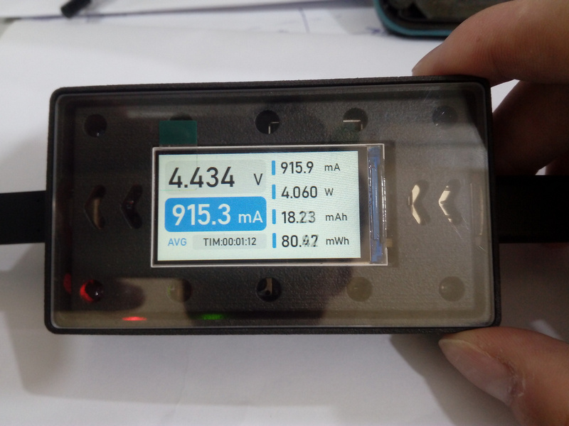

# Elecal 迷你 USB 电源功率计

## 项目简介

Elecal 是一个迷你的 USB 电源功率计，在硬件设计上可以同时测量电源电压电流以及功率，同时通过软件方案实现实时监测 `mAh，Ah，Wh` 等参数。
通过 `mAh，Ah，Wh` 这些电能参数可以方便的计量和计算被监测电源所输出的电能。 比如其中的 `mAh` 所能说明的是一颗 3000mAh 的电池可以提供在 300mA 恒流输出状态下持续 10 小时的电能输出能力。

## 项目文件说明

### gd32f103 目录

该目录是功率计固件源码以及编译工程所在目录。
该文件夹下的 `mdk5\` 目录即为 MDK-ARM（即 Keil5 集成开发环境） 的工程文件，`test\` 目录包含所有功能实现需要用到的驱动库以及源码。主要包含以下文件：

- GD32f103 的 USB Device 设备驱动，USB 驱动使用的设备描述符是 CDC 虚拟串口，使用 USB 接口可以用于和上位机进行数据通讯。
- ST7789V3 屏幕芯片驱动。
- 电压电流采样芯片驱动。
- 移植好的 LVGL8.2.0 的 UI 绘图库，这个 UI 库可以实现美观的图形界面，使用 LVGL 后就不需要我们自己控制屏幕逐像素的绘制图形来实现 UI 了。

**注意：如果需要编译此工程需要安装 keil5 集成开发环境，以及在 keil5 中安装 **GD32F10** 系列的芯片描述包, 安装好后点击本项目工程文件夹下的工程文件启动 keil 直接编译即可**。

GD32F10 芯片描述包可以到兆易官方网站下载，
找到 **GD32F1x0 AddOn** 压缩包，芯片描述包就在该压缩包下，下载地址：https://www.gd32mcu.com/cn/download/7?kw=GD32F1

### firmware 目录

Elecal 的编译固件，如果使用编译固件，需要使芯片进入 BOOT 模式，并使用预留的串口来写入该固件。

### image 目录

该目录是功率计制作实物效果图片展示，观看制作效果可以查看该目录下的实物照片。

### model 目录

该目录存放功率计外壳模型文件（STL 格式），外壳模型包含三个零件盒体，屏幕支架（需要使用半透明材料），上盖板（需要使用透明材料）。对于这个上盖板为了美观考虑最好使用透明亚克力板进行制作，普通 3D 打印无法实现透明。
目前该目录下共有两个版本的外壳模型，其中

**V1.0 版本所属文件为**： 
`elecal_box.stl`
`elecal_bracket.stl`
`elecal_panel.stl`

**V2.0 版本所属文件为**：
`elecal_box_v2.0.step`
`elecal_bracket_V2.0.step`
`elecal_panel_V2.0.step`
`elecal_button1_v2.0.step`
`elecal_button2_v2.0.step`
`elecal_button3_v2.0.step`
`elecal_button4_v2.0.step`

建议打印 V2.0 版本的外壳模型，
壳体 `elecal_button1_v2.0.step` 建议采用尼龙材质 3D 打印。
屏幕托盘 `elecal_bracket_V2.0.step` 建议采用透明树脂材质 3D 打印。
面板 `elecal_panel_V2.0.step` 建议采用亚克力或聚碳酸酯材质 CNC 加工。
按钮 `elecal_button1_v2.0.step` 建议采用尼龙材质 3D 打印。
按钮 `elecal_button2_v2.0.step` 建议采用尼龙材质 3D 打印。
按钮 `elecal_button3_v2.0.step` 建议采用尼龙材质 3D 打印。
按钮 `elecal_button4_v2.0.step` 建议采用尼龙材质 3D 打印。

### hardware 目录

功率电路 PCB 源文件工程，该文件夹下包含电路原理图，以及 PCB 制造文件（即 Gerber 文件）将 Gerber 文件压缩后到嘉立创网站下单即可将 PCB 打样出来。
PCB 设计时原本的设想是使用 **STM32F103RCT6** 这颗芯片作为微控制器使用的，但是奈何 **STM32F103RCT6** 价格较高，所以最终芯片使用的是 **GD32F103RCT6**，但是这对电路并不影响，因为 **GD32F103RCT6** 可以不需要任何改动而实现 PIN 对 PIN 的引脚以及外设兼容 **STM32F103RCT6**。
硬件已经打样验证通过，需要制作的话可以放心打样使用。

## 硬件介绍

- 微控制器：采用 GD32F103RCT6，芯片主频 96MHz 最高可达 108MHz，RAM 空间 64KB，ROM 空间 256KB。
- USB 设备: 支持 USB Device 协议。
- 屏幕：驱动芯片 ST7789V3，材质 IPS，采用 8 位并行 8080 通信接口，分辨率 320x170。
- Flash 芯片：GD25Q64 64MBit 即 8MByte。
- 电压电流采样芯片：采用 TI 的 INA226AIDGSR 芯片。 
- 外壳模型：尼龙或工程塑料 3D 打印。

## 3D 模型设计

**V1.0 版本模型效果**

**V2.0 版本模型效果**

## 实物

